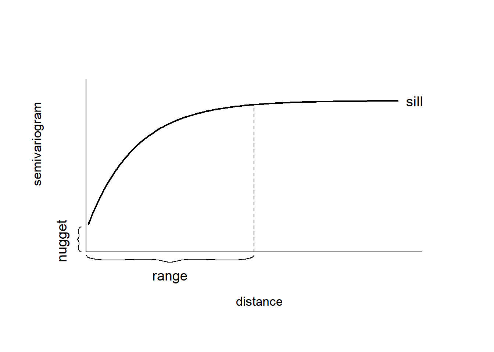
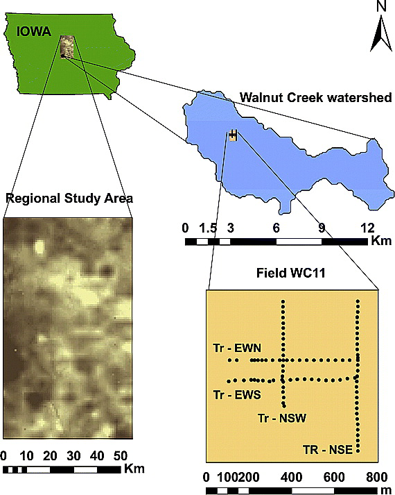

**1. Introduction**

In the last lab session, we introduced random field generation which was based on selection of covariance function. 

In this lab, we will explore a few standard geostatistical techniques involving the estimation of *isotropic/directional semivariograms* to understand the spatial structure of the data and determining the *correlation lengths* at different sampling scales.

However, before proceeding, let's install and load in the necessary libraries.

```{r}

#Load necessary libraries
library(geoR)
library(ggplot2)
library(sf)
library(sp)
library(gstat)
library(mapview)

```


**2. Variogram**

We can summarize the covariance structure of a spatial Gaussian random field with its variogram $2\gamma(.)$ (or semivariogram $\gamma(.)$). The variogram of a Gaussian random field $Z(.)$ is defined as the function

$$
{Var[Z(s_i)-Z(s_j)]=2\gamma(s_i-s_j)}
$$

Under the assumption of *intrinsic stationarity*, the constant-mean assumption implies

$$
{2\gamma(h)=Var(Z(s+h)-Z(s))=E[(Z(s+h)-Z(s))^2]}
$$

and the semivariogram can be easily estimated with the empirical semivariogram as follows:

$$
{2\hat\gamma(h)= \frac{1}{|N(h)|}\sum_{N(h)}(Z(s+h)-Z(s))^2},
$$

where $|N(h)|$ denotes the number of distinct pairs in $N(h) = [(s_i,s_j):s_i-s_j=h, i,j=1,...,n]$. Note that if the process is isotropic, the semivariogram is a function of the distance $h=||h||$.

Figure: A Typical semivariogram plot used for summarizing a spatial Gaussian random field.


The empirical semivariogram, when plotted against the separation distance, provides crucial insights into the continuity and spatial variability of the process. Often, at shorter distances, the semivariogram tends to be small, indicating a higher similarity among observations in close proximity compared to those farther apart. As the separation distance increases, the semivariogram tends to increase as well, suggesting a decrease in similarity between observations with increasing distance.

Beyond a certain separation distance known as the *range*, the semivariogram levels off and reaches a nearly constant value referred to as the sill. This indicates that spatial dependence between observations decays with distance within the range, and beyond that range, observations become spatially uncorrelated, resulting in a near constant variance. Thus, the *correlation length* is a measure of the spatial continuity in the variable of interest.

If there is a discontinuity or vertical jump at the origin of the plot, it signifies a nugget effect in the process. This effect is often attributed to measurement error but can also indicate a spatially discontinuous process. The empirical semivariogram serves as a valuable exploratory tool for evaluating the presence of spatial correlation in data.

*Note*: The sample variogram calculated from the data gives information about the sample properties only. The properties of the true population (or the underlying distribution) are then statistically determined by fitting a theoretical variogram model to the sample variogram. Whether the variogram parameters (i.e., the sill, nugget, and range/correlation length) determined from the sample truly represent the population depends on the nature of the soil variability and the sampling regime.

**3. Example Problem**

Here, we show how to estimate the variogram function of geostatistical data using the `variog()` function of geoR. We use the parana data from geoR which contains the average rainfall over different years for the period May to June at 123 monitoring stations in Paraná state, Brazil. We use the st_as_sf() package to create a sf object with the rainfall data and create a map depicting the rainfall values with ggplot2.

```{r}

d <- st_as_sf(data.frame(x = parana$coords[, 1],
                         y = parana$coords[, 2],
                         value = parana$data),
              coords = c("x", "y"))

ggplot(d) + geom_sf(aes(color = value), size = 2) +
scale_color_gradient(low = "blue", high = "orange") +
geom_path(data = data.frame(parana$border), aes(east, north)) +
theme_bw()

```

Now let's plot the semivarigram.

```{r}

plot(variog(coords = st_coordinates(d), data = d$value,
            option = "cloud", max.dist = 400))

plot(variog(parana, max.dist = 400))

```

The covariance parameters can be estimated by fitting a parametric covariance function to the empirical variogram. We can obtain the estimates by eye without a formal criterion, or by using ordinary or weighted least squares methods.

**3.1 Kriging**

Kriging is a spatial interpolation method used to obtain predictions at unsampled locations based on observed geostatistical data. This method originated in the field of mining geology and is named after South African mining engineer Danie G. Krige. Suppose that we have observed data $Z(s_1), Z(s_2), ..., Z(s_n)$, and wish to predict the value of $z$ at an arbitraty location $s_0 \in D$. The Ordinary Kriging estimator of $Z(s_0)$ is defined as the linear unbiased estimator

$$
{\hat{Z}(s_0)=\sum_{i=1}^n\lambda_iZ(s_i)}
$$

that minimizes the mean squared prediction error defined as

$$
{E[(\hat{Z}(s_0)-Z(s_0))^2]}.
$$

Kriging weights, derived from the spatial structure of sampled data, are obtained by fitting a variogram model to understand correlation changes with distance. Applied to known data values at sampled locations, these weights predict values at unsampled locations based on spatial correlation, considering proximity and similarity. They prioritize strongly correlated and nearby locations, assigning less weight to uncorrelated and distant points. The weights also account for the spatial arrangement of observations, reducing the impact of clusters in oversampled areas.

There are several types of Kriging differing by underlying assumptions and analytic goals. For example, *Simple Kriging* assumes the mean of the random field, $\mu(s)$, is known; **Ordinary Kriging** assumes a constant unknown mean,$\mu(s)=\mu$; and **Universal Kriging** can be used for data with an unknown non-stationary mean structure. 

**Varigram Cloud and Sample Varigram**

The `gstat` package (Pebesma and Graeler 2022) has functionality to model, predict, and simulate geostatistical data. The `variogram()` function of `gstat` can be used to calculate the variogram cloud and the sample variogram from data. 

```{r}
vc <- variogram(log(value) ~ 1, d, cloud = TRUE)
plot(vc)

v <- variogram(log(value) ~ 1, data = d)
plot(v)

```

**Fitted Varigram**

The `vgm()` function of gstat generates a variogram model. This function has arguments `model` with the model type (e.g., `Sph` for spherical and `Exp` for exponential), `nugget`, `psill` (partial sill, which is the sill minus the nugget) and `range`. A list of available models can be printed with `vgm()` and visualized with `show.vgms()`.

```{r}

vgm()

show.vgms(par.strip.text = list(cex = 0.75))

```

The `fit.variogram()` function fits a variogram model to a sample variogram. Arguments of this function include `object` with the sample variogram, and `model` with the variogram model which is an output of `vgm()` with arguments `nugget`, `psill`, and `range` denoting initial values of the iterative fitting algorithm. The fitting method is specified in `fit.method` and can be ordinary (unweighted) or weighted least squares using a weighting scheme that gives most weight to early lags and downweights those lags with a small number of pairs. 

```{r}

vinitial <- vgm(psill = 0.5, model = "Sph",
                range = 900, nugget = 0.1)
plot(v, vinitial, cutoff = 1000, cex = 1.5)

```
Then, we fit a variogram providing the sample variogram and choosing a spherical model (model = "Sph"), and the initial values for the partial sill, range, and the nugget for the iterative fitting algorithm.


```{r}

fv <- fit.variogram(object = v,
                    model = vgm(psill = 0.5, model = "Sph",
                                range = 900, nugget = 0.1))
fv
plot(v, fv, cex = 1.5)

```


**4. Assignment**

Soil moisture exhibits significant variation in both space and time, influenced by diverse factors like soil properties, topography, vegetation, and atmospheric conditions. Although there has been advancements in satellite soil moisture products in last decade, the spatial resolution of remotely sensed soil moisture data frequently diverges from the requirements of scientific communities, prompting the application of up- or down-scaling algorithms to make the data applicable across various disciplies/use-cases (e.g., general circulation models, weather forecasts, hydrologic models, and precision agriculture). 

Therefore, comprehensive understanding of the spatiotemporal variability of in-situ (or point) soil moisture patterns, encompassing diverse scales of space and time, and the associated geophysical parameters (e.g., topography, rainfall, soil texture, and vegetation) is essential for numerous hydrological research and applications. These applications include flood and drought prediction, climate forecast modeling, and agricultural management practices. Thus, hydrologists often rely on "geostatistical" methods to explore the space-time characteristics of soil moisture patterns.

**4.1 Study Site** 

Figure 1 shows the regional study area of the SMEX02 campaign in Iowa (including the insets of 100 km2 Walnut Creek (WC) watershed and the 800 m × 800 m WC11 field) located south of Ames, Iowa. The climate of the region is mostly humid, with an average annual precipitation of 835 mm. The heaviest rainfall usually occurs in May and June and amounts to about one third of the annual total. The regional topography consists of low relief (maximum elevation ∼320 m) with poor surface drainage due to the existing prairie potholes of glacial origin. Soil texture varies considerably from fine sandy loam to clay, with the majority classified as silt loam with a relatively low permeability. Corn (50%) and soybean (40%) crops dominate the land cover with row type cultivation.

 


**4.2 Data Description**

The SMEX02 field campaign took place in Iowa from 25 June to 12 July 2002. During SMEX02, ground-based soil moisture measurements were done for 12 days at 92 sampling points in the WC11 field. Measurements were conducted between 1100 and 1500 local time (CDST). Sampling points were located at nearly 30 m intervals along the four transects oriented east–west (EWN and EWS) and north–south (NSE and NSW) within the field (Figure 1). 

The airborne Polarimetric Scanning Radiometer (PSR) observations (resolution: 800 m × 800 m, regional coverage: 144 × 70 pixels) were collected for 10 days, between 25 June and 12 July, during SMEX02.

**4.3 Objectives & Deliverables**

Theta probe measured soil moisture data for the WC11 field in Iowa for a dry and wet day (26th June- dry and 5th July, 2002- wet) has been provided. The objective of the exercise is to determine the soil moisture distribution of the entire field using geostatistics and evaluate the accuracy of the predicted soil moisture surface. 

1.    Subset 70 % of your data (Data.xls) to generate a ‘training dataset’ and the remaining 30 % as test dataset’. Perform the following tasks on the training dataset:
*   Explore the semi-variogram cloud of your dataset. Do you think there is appreciable anisotropy in your dataset?
*   Assume isotropy and fit the ‘best’ semi-variogram to your data. Optimize the selected variogram and write the nugget, range and partial sill value. Copy the graph showing the averaged semi-variogram values (+ signs) and the best fit theoretical semi-variogram. Present the graphs for both days. 
*   How would you interpret the difference in the ‘range’ obtained for the two days? 
*   Create an interpolation map of your final kriged surfaces. 

2.    Validate your best kriging model with the test data (created in 1). Provide the maximum and minimum error in your analysis. Write briefly on the quality of your validation results. 


**Submission Guidelines**

1.    All submissions are due in 1 week from the date of assignment, prior to the lab session/class. 

2.    Please be to-the-point in your answers (if not asked to elaborate) and follow the principles of scientific reporting (formal, complete and meaningful sentences supplemented with numbers and reasoning wherever applicable). If large language models are used, pleas make it clear in your submissions on top of the first page (beginning of your assignment solutions).

3.    Email your solutions to `debmishra@tamu.edu` as a *single PDF file* (unless other file types are needed to support your solutions). Please fashion the subject of the email and the name of the submitted document name as: *BAEN675_Assignment#[number]_[Last name]*.

**Reading Suggestions**

*   Joshi, C., and B. P. Mohanty (2010), Physical controls of near-surface soil moisture across varying spatial scales in an agricultural landscape during SMEX02, Water Resour. Res., 46, W12503, doi:10.1029/2010WR009152.
