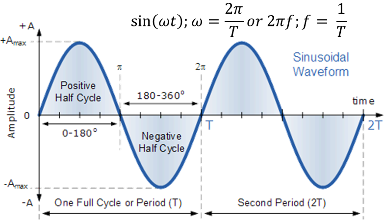

**1. Introduction**

We can use Fourier Transform to convert a signal from its time-domain to its frequency domain. The peaks in the frequency spectrum indicate the most occurring frequencies in the signal. The larger and sharper a peak is, the more prevalent a frequency is in a signal.

```{r}

#Load necessary libraries
library(psd)
library(ggplot2)
library(Rwave)
library(lattice)
library(wavelets)
library(gridExtra)

```

**2. Simple (& Complex) Wave**

We are familiar that $sin(\pi)$ or $sin(180)$ is 1. Here $\pi$ represents angles in `radians`, which is equivalent to `180 degrees`. A typical example of a sine wave is given in the following figure. Such a wave (sine in this case) is called $2\pi$ `periodic`, because it repeats itself after $2\pi$ time interval (period).

Figure 1: A typical sine wave of $2\pi$ periodicity.



Now because we take *sin(angle)*, i.e., sine at a specified angle (which can be in radians or in degrees), implies that whenever we write $sin(\omega t)$, $\omega t$ should together have units of an *angle*. In fact, t is in *seconds*, which leaves $\omega$ to have units of `radians per sec`. As such $\omega$ represents angular frequency, which is a measure of how much angle is covered per unit time ($2\pi /T$). At this stage we can establish a relationship between regular frequency ($f$) and angular frequency ($\omega$), which is given by:

$$
{\omega=2\pi f}
$$

or $f = 1/T$, having units of *cycles/sec* or *Hertz (Hz)*. Here are three examples of sine waves with frequencies 1 Hz, 5 Hz, and 10 Hz:

```{r}

# Custom Function to generate sine wave
generate_sine_wave <- function(freq, phase = 0, n_points = 500) {
  x <- seq(from = 0, 
           to = 2*pi, 
           length.out = n_points)  #desired length of the sequence
  y <- sin(freq * x + phase)
  return(data.frame(x = x, y = y))
}

# Create sine waves of different frequencies
freqs <- c(1, 5, 10)  # Frequencies
waves <- lapply(freqs, generate_sine_wave)

# Combine data frames
waves_df <- do.call(rbind, waves)
waves_df$freq <- rep(freqs, each = nrow(waves_df) / length(freqs))

# Plot using ggplot2
ggplot(waves_df, aes(x = x, y = y, color = as.factor(freq))) +
  geom_line() +
  facet_wrap(~ freq, scales = "free_y") +
  labs(x = "Angle (Radians)", y = "Amplitude", color = "Frequency") +
  theme_classic() +
  scale_x_continuous(breaks = seq(0, 2*pi, by = pi), 
                     labels = c("0", expression(paste(pi)), expression(paste("2" * pi))))

```

Note that each of these waves have an *amplitude of 1*. Now we will generate a `complex function` by summing all three sine waves of different frequencies. `aggregate()` function is used to aggregate the `y` values of sine waves at each `x` value by summing them together, resulting in a complex wave. 

```{r}

# Create a complex wave by summing the sine waves
complex_wave <- aggregate(y ~ x, data = waves_df, FUN = sum)

# Plot the complex wave using ggplot2
ggplot(complex_wave, aes(x = x, y = y)) +
  geom_line() +
  geom_hline(yintercept = 0, color = "indianred")+
  geom_vline(xintercept = pi, color = "indianred")+
  labs(x = "Angle (Radians)", y = "Amplitude", title = "Complex Wave")+
  theme_classic() +
  scale_x_continuous(breaks = seq(0, 2*pi, by = pi), 
                     labels = c("0", expression(paste(pi)), expression(paste("2" * pi))))

```

Looking at the complex wave itself, is it possible to realize that it is made up of just 3 sine waves? Is this complex wave periodic? Is there a way/method to test the periodicity of such complex waves? Let's extend the plot till $4\pi$ and check if there's any periodicity.

```{r}
# Custom Function to generate sine wave
generate_sine_wave <- function(freq, phase = 0, n_points = 500) {
  x <- seq(from = 0, 
           to = 4*pi,  #Make it 4*pi
           length.out = n_points)  #desired length of the sequence
  y <- sin(freq * x + phase)
  return(data.frame(x = x, y = y))
}

# Create sine waves of different frequencies
freqs <- c(1, 5, 10)  # Frequencies
waves <- lapply(freqs, generate_sine_wave)

# Combine data frames
waves_df <- do.call(rbind, waves)
waves_df$freq <- rep(freqs, each = nrow(waves_df) / length(freqs))

# Create a complex wave by summing the sine waves
complex_wave <- aggregate(y ~ x, data = waves_df, FUN = sum)

# Plot the complex wave using ggplot2
ggplot(complex_wave, aes(x = x, y = y)) +
  geom_line() +
  geom_hline(yintercept = 0, color = "indianred")+
  geom_vline(xintercept = 2*pi, color = "indianred")+
  labs(x = "Angle (Radians)", y = "Amplitude", title = "Complex Wave")+
  theme_classic() +
  scale_x_continuous(breaks = seq(0, 4*pi, by = pi), 
                     labels = c("0", expression(paste(pi)), expression(paste("2" * pi)), expression(paste("3" * pi)), expression(paste("4" * pi))))

```
It seems that the complex wave is still $2\pi$ periodic, i.e., it repeats itself (amplitude) after a time period of $2\pi$. But how do we find the frequencies which make up such a complex wave?

**3. Fourier Analysis**

*Joseph Fourier* showed that any periodic wave can be represented by a sum of simple sine and cosine waves (*a.k.a. sinusoids*). This sum is called the `Fourier Series`, which can formulated as:

$$
x(t) = \frac{1}{2} a_{0} + \sum_{f = 1}^{\infty} (a_{f}cos2\pi ft + b_{f}sin2\pi ft)
$$

where $a_{f}$ and $b_{f}$ represent the fourier *coefficients*, and $x(t)$ represents our signal. What we actually are interested is in calculating these fourier coefficients. If we think in terms of the complex wave that we just created, we can see that as our signal is made up of three sine functions, the coefficients $a_{f}$ will all tend to $0$. Also, the coefficients $b_{f}$ will be larger for $f = 1, 5, and 10 Hz$ for $t$ at which their contribution is maximum.

Now if we recollect the *Euler's formula* which links complex exponentials to sines and cosines, given by:

$$
exp(i\phi) = cos(\phi) + isin(\phi)
$$

or, if we replace $\phi$ by $2\pi ft$, we get

$$
exp(i2\pi ft) = cos(2\pi ft) + isin(2\pi ft)
$$

This expression provides a gateway to utilize a fourier series for converting a *time signal to a frequency (or spectral) signal* - which is know as `Fourier transform`. Without going into details, it suffices here to state that by taking the complex exponential to the other side, our fourier transform formula takes the form:

$$
X(F) = \int_{-\infty}^{\infty} x(t) exp(-i2\pi Ft)\; dt
$$

This process of multiplying the values $x(t)$ with $exp(-i2\pi Ft)$ is also know as *convolution*. Interestingly, this is the same idea behind *convolution neural networks*. In a *discrete case*, the fourier transform is reformulated as:

$$
X_{k} = \sum_{n = 0}^{N-1} x_{n} * exp(-i2\pi kn/N)
$$

where $X_{k}$ represents $k-th$ complex fourier coefficient, $N$ is total number of samples (or time observations), while $n$ is the $t-th$ point in time. Also note that: $k/N \sim F$ and $n \sim t$.

Now we can easily expand the above summation for each value of $k$. This will take the form:

$$
X_{k} = x_{0}* exp(-i2\pi k(0)/N) + x_{1}* exp(-i2\pi k(1)/N) + x_{2}* exp(-i2\pi k(2)/N) + ...
$$

These complex exponential values can be easily computed using the Euler's formula and replacing exponentials with cosines and sines. Once we do that, we will end up with a constant complex number of the form:

$$
X_{k} = A_{k} + iB_{k}
$$

whose magnitude, computed as:

$$
Mag = ({A_{k}}^{2} + {B_{k}}^{2})^{1/2}
$$

corresponds to the magnitude of the sinusoid of the frequency band $X_{k}$, while the phase angle, computed as:

$$
\theta = tan^{-1} \frac{B_{k}}{A_{k}}
$$
 
corresponds to how much that sinusoid of the frequency band $X_{k}$ is shifted. 

To understand this, let's take a simple example of a $1 Hz$ sine wave with an amplitude of $1$, and we will fix our sampling frequency to $8 Hz$, and number of samples (N) to $8$. Note that, the time between two samples is the sampling period, and the reciprocal the sampling period is the sampling rate.**

```{r}
# Set seed for reproducibility
set.seed(42)

# Parameters
frequency <- 1  # Frequency of the sine wave (Hz)
amplitude <- 1  # Amplitude of the sine wave
sampling_rate <- 8  # Sampling frequency (Hz)
N <- 8  # Number of samples

# Generate time vector
time <- seq(0, (N - 1) / sampling_rate, by = 1 / sampling_rate)

# Generate sine wave
sine_wave <- amplitude * sin(2 * pi * frequency * time)

# Create data frame
sine_data <- data.frame(Time = time, Amplitude = sine_wave)

# Plot using ggplot2
ggplot(sine_data, aes(x = Time, y = Amplitude)) +
  geom_line() + geom_point()+
  labs(x = "Time (s)", y = "Amplitude", title = "1 Hz Sine Wave") +
  theme_minimal()

```

R provides a function `fft()` to calculate the *fast fourier transform* which is a faster way of performing discrete fourier transform. Let's use this function and see if we can retrieve values for our signal's amplitude and frequency.


```{r}
# Compute Fourier transform
fft_result <- fft(sine_wave)

# Calculate frequency axis
freq <- seq(0, sampling_rate, length.out = N)

# Extract magnitude values
magnitude <- Mod(fft_result)

# Create data frame for amplitude versus frequency plot
fft_data <- data.frame(Frequency = freq, Magnitude = magnitude)

# Plot amplitude versus frequency
ggplot(fft_data, aes(x = Frequency, y = Magnitude)) +
  geom_line() +
  labs(x = "Frequency (Hz)", y = "Magnitude", title = "Magnitude vs. Frequency") +
  theme_minimal()

```

Interestingly we see two peaks (seems something fishy). 

**Note:Why do we see two frequency spikes (replicas) in above graphs?**

*For a purely real input signal of N points you get a complex output of N points with complex conjugate symmetry about N/2. You can ignore the output points above N/2, since they provide no useful additional information for a real input signal, but if you do plot them you will see the aforementioned symmetry, and for a single sine wave you will see peaks at bins n and N - n. (Note: you can think of the upper N/2 bins as representing negative frequencies.) In summary, for a real input signal of N points, you get N/2 useful complex output bins from the FFT, which represent frequencies from DC (0 Hz) to Nyquist (Fs / 2).*

To rectify this, we typical look at the plot to a `Nyquist limit` which is half the sampling rate of a "signal". For our case this will be 4 (because we have taken sampling rate to be 8).

```{r}

# Compute Fourier transform
fft_result <- fft(sine_wave)

# Calculate frequency axis
freq <- seq(0, sampling_rate/2, length.out = N/2 + 1)

# Extract magnitude values
magnitude <- Mod(fft_result)[1:(N / 2 + 1)]

# Create data frame for amplitude versus frequency plot
fft_data <- data.frame(Frequency = freq, Magnitude = magnitude)

# Plot amplitude versus frequency
ggplot(fft_data, aes(x = Frequency, y = Magnitude)) +
  geom_line() +
  labs(x = "Frequency (Hz)", y = "Magnitude", title = "Magnitude vs. Frequency (up to Nyquist limit)") +
  theme_minimal()

```

Since, the magnitude here is 4 times our original amplitude (which was 1), this hints that we should **divide the magnitude by half of number of samples to get out amplitude!** 

```{r}
# Compute Fourier transform
fft_result <- fft(sine_wave)

# Calculate frequency axis
freq <- seq(0, sampling_rate/2, length.out = N/2 + 1)

# Normalize magnitude values to get amplitude
amplitude <- Mod(fft_result)[1:(N / 2 + 1)]/(N/2)

# Create data frame for amplitude versus frequency plot
fft_data <- data.frame(Frequency = freq, Amplitude = amplitude)

# Plot amplitude versus frequency
ggplot(fft_data, aes(x = Frequency, y = Amplitude)) +
  geom_line() +
  labs(x = "Frequency (Hz)", y = "Amplitude", title = "Amplitude vs. Frequency (up to Nyquist limit)") +
  theme_minimal()

```

Now we have recovered our peak amplitude of $1$ and corresponding frequency of $1$. Let's try this recipe on our complex wave.

```{r}
# Parameters
frequencies <- c(1, 5, 10)  # Frequencies of the sine waves (Hz)
amplitudes <- c(1, 1, 1)  # Amplitudes of the sine waves
sampling_rate <- 100  # Sampling frequency (Hz)
N <- 1000  # Number of samples

# Generate time vector
time <- seq(0, (N - 1) / sampling_rate, by = 1 / sampling_rate)

# Generate complex wave by summing sine waves
complex_wave <- rowSums(sapply(1:length(frequencies), function(i) amplitudes[i] * sin(2 * pi * frequencies[i] * time)))

# Compute Fourier transform
fft_result <- fft(complex_wave)

# Calculate frequency axis
freq <- seq(0, sampling_rate / 2, length.out = N / 2 + 1)

# Extract amplitude values (only for positive frequencies)
amplitude <- Mod(fft_result)[1:(N / 2 + 1)]/(N/2)

# Create data frame for amplitude versus frequency plot
fft_data <- data.frame(Frequency = freq, Amplitude = amplitude)

# Plot amplitude versus frequency
ggplot(fft_data, aes(x = Frequency, y = Amplitude)) +
  geom_line() +
  labs(x = "Frequency (Hz)", y = "Amplitude", title = "Amplitude vs. Frequency (Complex Wave)") +
  theme_minimal()

```

Whoop! Now we see peaks at the frequencies 1, 5 and 10 Hz. Isn't this magical? Let's now try to plot it's `periodogram`. **Note: The periodogram graphs a measure of the relative importance of possible frequency values that might explain the oscillation pattern of the observed data.**

```{r}
# Compute periodogram
periodogram <- spec.pgram(complex_wave, plot = FALSE)

# Create data frame for periodogram plot
periodogram_data <- data.frame(Frequency = periodogram$freq, Power = periodogram$spec)

# Plot periodogram using ggplot2
ggplot(periodogram_data, aes(x = Frequency, y = Power)) +
  geom_line() +
  labs(x = "Frequency (Hz)", y = "Power", title = "Periodogram of Complex Wave") +
  theme_minimal()

```

This graph is similar to the previous one with three peaks, but different power-frequency combinations. **How to interpret this graph? Why are the peaks at frequencies 0.01, 0.05 and 0.1 instead of 1, 5 and 10? This is left as an assignment for the students. (Bonus Question)**

**4. Adding Noise & Trend to the Signal**

Let's deepen our understanding by using a simple example of `white noise` being added to our complex wave singal. **Note that a white noise time series is defined by a zero mean, constant variance, and zero correlation.**

```{r}

# Generate white noise
white_noise <- rnorm(N, mean = 0, sd = 0.5)

# Add white noise to complex wave
complex_wave_with_noise <- complex_wave + white_noise

# Perform FFT
fft_result <- fft(complex_wave_with_noise)

# Calculate frequency axis
freq <- seq(0, sampling_rate / 2, length.out = N / 2 + 1)

# Extract amplitude values (only for positive frequencies)
amplitude <- Mod(fft_result)[1:(N / 2 + 1)]/(N/2)

# Create data frames for time and frequency plots
time_data <- data.frame(Time = seq(0, (N - 1) / sampling_rate, by = 1 / sampling_rate), Amplitude = complex_wave_with_noise)
fft_data <- data.frame(Frequency = freq, Amplitude = amplitude)

# Plot amplitude versus time
p1 <- ggplot(time_data, aes(x = Time, y = Amplitude)) +
  geom_line() +
  labs(x = "Time (s)", y = "Amplitude", title = "Amplitude vs. Time") + theme_classic()

# Plot amplitude versus frequency
p2 <- ggplot(fft_data, aes(x = Frequency, y = Amplitude)) +
  geom_line() +
  labs(x = "Frequency (Hz)", y = "Amplitude", title = "Amplitude vs. Frequency") + theme_classic()

# Plot both curves
grid.arrange(p1, p2, ncol = 1)

```

We see that with noise being added, we still see amplitude peaks at frequencies of 1, 5 and 10 however, each measurement has been affected to some degree by the white noise.

Now we will add a trend to the second half of the time series.

```{r}
# Define the length of the time series
half_length <- length(complex_wave_with_noise) / 2

# Add a positive trend to the second half of the time series
trend <- seq(0.1, 5, length.out = half_length)  # Adjust the trend values as needed
complex_wave_with_trend <- complex_wave_with_noise
complex_wave_with_trend[half_length + 1:length(trend)] <- complex_wave_with_noise[half_length + 1:length(trend)] + trend

# Perform FFT
fft_result_trend <- fft(complex_wave_with_trend)

# Calculate frequency axis
freq_trend <- seq(0, sampling_rate / 2, length.out = N / 2 + 1)

# Extract amplitude values (only for positive frequencies)
amplitude_trend <- Mod(fft_result_trend)[1:(N / 2 + 1)]/(N/2)

# Create data frames for time and frequency plots
time_data_trend <- data.frame(Time = seq(0, (N - 1) / sampling_rate, by = 1 / sampling_rate), Amplitude = complex_wave_with_trend)
fft_data_trend <- data.frame(Frequency = freq_trend, Amplitude = amplitude_trend)

# Plot amplitude versus time
p3 <- ggplot(time_data_trend, aes(x = Time, y = Amplitude)) +
  geom_line() +
  labs(x = "Time (s)", y = "Amplitude", title = "Amplitude vs. Time (with Trend)")+ theme_classic()

# Plot amplitude versus frequency
p4 <- ggplot(fft_data_trend, aes(x = Frequency, y = Amplitude)) +
  geom_line() +
  labs(x = "Frequency (Hz)", y = "Amplitude", title = "Amplitude vs. Frequency (with Trend)")+ theme_classic()

# Plot both curves
grid.arrange(p3, p4, ncol = 1)

```

This is the *breaking point* of Fourier transform. **Note: The general rule is that this approach of using the Fourier Transform will work very well when the frequency spectrum is `stationary`.**  That is, the frequencies present in the signal are not time-dependent; if a signal contains a frequency of `x` Hz, this frequency should be present equally anywhere in the signal. The more non-stationary/dynamic a signal is, the worse the results will be. That’s too bad, since most of the signals we see in real life are non-stationary in nature. By adding a trend, we have made the series non-stationary. A better approach for analyzing non-stationary signals is to use the `Wavelet Transform` which will be covered in next lab session.

**5. Assignment**

Download `relative humidity` and `temperature` data from `TexMesonet` (https://www.texmesonet.org/DataProducts/CustomDownloads) for any one season (Mar-Apr-May/Jun-Jul-Aug/Sep-Oct-Nov/Dec-Jan-Feb) for any available year and for any county of your choice. *Note that the maximum time span for one time request is 1 month, so you have to download three times for three months.*

Describe the season, year and county for which you downloaded the data. What are the units of both the variables? What is the sampling frequency? Repeat the FFT process and discuss the power spectrum (amplitude versus frequency) in terms of dominant frequencies and the governing physical (meteorological/climatological) processes that you think might be controlling such fluctuations.   (50 points)

Additionally, answer the following questions with supporting plots/graphs:

Question 1: Are both time series stationary? Why or why not?(10 points)

Question 2: What is the maximum identifiable frequency (a.k.a Nyquist frequency) for both signals? Why? (10 points) 

Question 3:  Do you think there is noise in both the time series? Why or why not? (10 points) 

Question 4: What are the dominant periodicity observed in both the time series?   (10 points) 

Question 5: Comment on similarity / dissimilarity in the periodograms of relative humidity and temperature time series.  (10 points) 

**Submission Guidelines**

1.    All submissions are due in 1 week from the date of assignment, prior to the lab session/class. 

2.    Please be to-the-point in your answers (if not asked to elaborate) and follow the principles of scientific reporting (formal, complete and meaningful sentences supplemented with numbers and reasoning wherever applicable). If large language models are used, pleas make it clear in your submissions on top of the first page (beginning of your assignment solutions).

3.    Email your solutions to `debmishra@tamu.edu` as a *single PDF file* (unless other file types are needed to support your solutions). Please fashion the subject of the email and the name of the submitted document name as: *BAEN675_Assignment#[number]_[Last name]*.

**Reading Suggestions**

*   Improving the Spectral Analysis of Hydrological Signals to Efficiently Constrain Watershed Properties; https://doi.org/10.1029/2018WR024579  

*   On the spectrum of soil moisture from hourly to interannual scales; https://doi.org/10.1029/2006WR005356 

