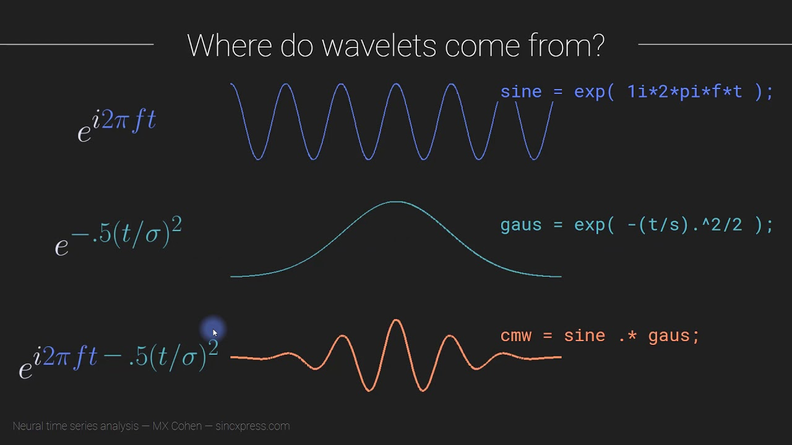
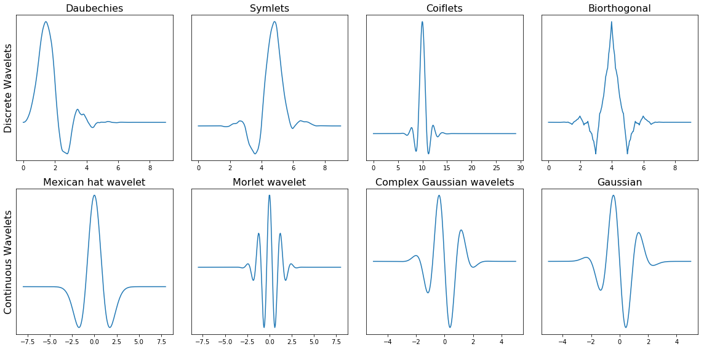

### **1. Introduction**

In the previous assignment, we have seen how the `Fourier Transform` works. We can use the Fourier Transform to  transform a signal from its `time-domain` to its `frequency domain`. The peaks in the frequency spectrum indicate the most occurring frequencies in the signal. The larger and sharper a peak is, the more prevalent a frequency is in a signal.

**Note**: The general rule is that this approach of using the Fourier Transform will work very well when the frequency spectrum is `stationary`. That is, the frequencies present in the signal are not time-dependent; if a signal contains a frequency of $x Hz$ this frequency should be present equally anywhere in the signal. The more non-stationary/dynamic a signal is, the worse the results will be. That’s too bad, since most of the signals we see in real life are non-stationary in nature. A much better approach for analyzing dynamic signals is to use the `Wavelet Transform` instead of the Fourier Transform.

But before proceeding, let's load in the required libraries.

```{r}

#Load necessary libraries
library(ggplot2)
library(wavelets)
library(WaveletComp)
library(biwavelet)
library(lubridate)
library(dplyr)
library(hrbrthemes)
library(stringr)
library(scico)
library('plot.matrix')

# Package "hrbrthemes" is archived; install it using the following codes:
# install.packages(c("extrafont", "gdtools"))
# install.packages(
#   "https://cran.r-project.org/src/contrib/Archive/hrbrthemes/hrbrthemes_0.8.7.tar.gz",
#   repos = NULL,
#   type = "source"
# )

```

### **2. From Fourier Transform to Wavelet Transform**

The thing about the Fourier Transform is that it has a *high resolution in the frequency-domain but zero resolution in the time-domain*. This means that it can tell us exactly which frequencies are present in a signal, but not at which location in time these frequencies have occurred. This can easily be demonstrated as follows:

```{r}
# Define frequencies and amplitudes
frequencies <- c(1, 2, 3)
amplitudes <- c(1, 1, 1)

# Define sampling rate and number of samples
sampling_rate <- 100
N <- 1000

# Generate time vector
time <- seq(0, (N - 1) / sampling_rate, by = 1 / sampling_rate)

# Generate complex wave 1 by summing sine waves differently
complex_wave1 <- amplitudes[1] * sin(2 * pi * frequencies[1] * time) +
                  amplitudes[2] * sin(2 * pi * frequencies[2] * time) +
                  0.5*amplitudes[3] * sin(2 * pi * frequencies[3] * time)

# Generate complex wave 2 by summing sine waves differently
complex_wave2 <- 0.5*amplitudes[1] * sin(2 * pi * frequencies[1] * time) +
                  2* amplitudes[2] * sin(2 * pi * frequencies[2] * time) -
                  2*amplitudes[3] * sin(2 * pi * frequencies[3] * time)


# Create data frames for each complex wave
df_wave1 <- data.frame(time = time, value = complex_wave1)
df_wave2 <- data.frame(time = time, value = complex_wave2)

# Plot both complex waves using ggplot
ggplot() +
  geom_line(data = df_wave1, aes(x = time, y = value, color = "Complex Wave 1")) +
  labs(title = "Complex Waves", x = "Time", y = "Amplitude") +
  scale_color_manual(values = c("Complex Wave 1" = "black", "Complex Wave 2" = "steelblue")) +
  theme_minimal()

ggplot() +
  geom_line(data = df_wave2, aes(x = time, y = value, color = "Complex Wave 2")) +
  labs(title = "Complex Waves", x = "Time", y = "Amplitude") +
  scale_color_manual(values = c("Complex Wave 1" = "black", "Complex Wave 2" = "steelblue")) +
  theme_minimal()

# Compute Fourier transform
fft_result1 <- fft(complex_wave1)
fft_result2 <- fft(complex_wave2)

# Calculate frequency axis
freq <- seq(0, sampling_rate / 2, length.out = N / 2 + 1)

# Extract amplitude values (only for positive frequencies)
amplitude1 <- Mod(fft_result1)[1:(N / 2 + 1)]/(N/2)
amplitude2 <- Mod(fft_result2)[1:(N / 2 + 1)]/(N/2)


# Create data frame for amplitude versus frequency plot
fft_data1 <- data.frame(Frequency = freq, Amplitude = amplitude1)
fft_data2 <- data.frame(Frequency = freq, Amplitude = amplitude2)

# Plot amplitude versus frequency
ggplot(fft_data1, aes(x = Frequency, y = Amplitude)) +
  geom_line() +
  labs(x = "Frequency (Hz)", y = "Amplitude", title = "Amplitude vs. Frequency (Complex Wave)") +
  theme_minimal()

ggplot(fft_data2, aes(x = Frequency, y = Amplitude)) +
  geom_line() +
  labs(x = "Frequency (Hz)", y = "Amplitude", title = "Amplitude vs. Frequency (Complex Wave)") +
  theme_minimal()

```

What is important to note here is that the two frequency spectra contain similar three peaks, so it cannot tell us where in the signal these frequencies are present. In other words, the Fourier Transform can not distinguish between these two combined signals.

In trying to overcome this problem, scientists have come up with the `Short-Time Fourier Transform`. In this approach the original signal is splitted into several parts of equal length (which may or may not have an overlap) by using a sliding window before applying the Fourier Transform. The idea is quite simple: if we split our signal into 10 parts, and the Fourier Transform detects a specific frequency in the second part, then we know for sure that this frequency has occurred between $\frac{2}{10}$th and $\frac{3}{10}$th of our original signal.

The main problem with this approach is that you run into the theoretical limits of the Fourier Transform known as the `uncertainty principle`. The smaller we make the size of the window the more we will know about where a frequency has occurred in the signal, but less about the frequency value itself. The larger we make the size of the window the more we will know about the frequency value and less about the time.

A better approach for analyzing signals with a *dynamical frequency spectrum* is the `Wavelet Transform`. The Wavelet Transform has a high resolution in both the frequency- and the time-domain. It not only tells us which frequencies are present in a signal, but also at which time these frequencies have occurred. This is accomplished by working with *different scales*. **First we look at the signal with a large scale/window and analyze ‘large’ features and then we look at the signal with smaller scales in order to analyze smaller features.**

### **3. How does the Wavelet Transform work?**

In general, a wavelet is a wave-like oscillation that is localized in time. This allows the wavelet transform to obtain time-information in addition to frequency information. 

Wavelets have two basic properties: `scale` and `location`. 

1.    `Scale (or dilation)` defines how “stretched” or “squished” a wavelet is. This property is related to frequency as defined for waves. 

2.    `Location (or translation)` defines where the wavelet is positioned in time (or space).

We normally denote a wavelet with a function $\psi$, and refer it as `mother wavelet`. The idea is that, by performing a series of translations and dilations, we can generate a family of wavelets, given by the formulation:

$$
{\psi_{a,b}(t)=\frac{1}{a^{1/2}}\psi(\frac{t-b}{a})}
$$

where $a$ denotes the `dilation` parameter, corresponding to the width of the wavelet support, and $b$ the `translation` parameter, corresponding to the position of the wavelet. The continuous wavelet transform of a function $f$ is then defined as the convolution of $f$ with the wavelet family $\psi_{a,b}(t)$:

$$
{\tilde{f}(a,b)=\int_{-\infty}^{\infty}f(t)\psi*_{a,b}(t)}dt
$$

where $\psi*_{a,b}(t)$ denotes, in the case of complex-valued wavelets, the complex conjugate.

*Figure 1: The difference between a sine-wave, a Gaussian and a Wavelet. Multiplying a real valued sine wave with real valued Gaussian at each instance of time (element wise multiplication) gives a real valued Morlet wavelet*
  


#### **3.1. Wavelet families**

Figure 1 provides us an idea of how `Morlet` wavelet (*a type of wavelet*) is constructed by using a real valued sine wave and Gaussian signal. This lends us the power to create different wavelets by using different combinations of wave-forms, giving rise to, what we call as, families (types) of wavelets. The wavelet families differ from each other since for each family a different trade-off has been made in how compact and smooth the wavelet looks like. This means that *we can choose a specific wavelet family which fits best with the features we are looking for in our signal*.

*Figure 2: Several families of Wavelets. In the first row we see discrete wavelets and in the second row we see several continuous wavelets.*
 

To re-emphasize, each type of wavelets has a different shape, smoothness and compactness and is useful for a different purpose. These continuous, complex-valued wavelets lead to a continuous, complex-valued wavelet transform of the time series at hand, and is therefore *information-preserving* with any careful selection of time and frequency resolution parameters.

To understand the concepts better, let's work with one of the wavelet families, known as `Morlet` wavelet.

### **4. Morlet Wavelet**

For this, we will utilize the R library `WaveletComp` which analyzes the frequency structure of uni- and bivariate time series using the `Morlet` wavelet. The wavelet name is based on **Jean Morlet**, a French geophysicist who, based on his knowledge of seismic processing algorithms, proposed this method of time-frequency analysis in 1982.

The “mother” Morlet wavelet, in the version implemented in `WaveletComp`, is:

$$
{\psi(t)=\pi^{-1/4}exp(i \omega t)exp(-t^2/2)}
$$

The Morlet wavelet transform of a time series ($x_t$) is defined as the *convolution* of the series with a set of `wavelet daughters` generated by the mother wavelet by translation in time by $\tau$ and scaling by $s$:

$$
{ Wave(\tau, s)=	\sum_{t} x_t	\frac{1}{s^{1/2}} \psi^{*} (\frac{t - \tau}{s}) } 
$$

with $*$ denoting the complex conjugate.The position of the particular daughter wavelet in the time domain is determined by the localizing time parameter $\tau$ being shifted by a time increment of dt. The choice of the set of scales $s$ determines the wavelet coverage of the series in the frequency domain. *To approximate the continuous wavelet transform, the convolution should be done N times for each scale, where N is the number of points in the time series.*

**Note: The scale value is a fractional power of 2 (i.e., $T/2^{m}$)!**

The local `amplitude` of any periodic component of the time series under investigation, and how it evolves with time, can then be retrieved from the modulus of its wavelet transform.

$$
{ Ampl(\tau, s)=	\frac{1}{s^{1/2}} |Wave(\tau, s)| } 
$$

The square of the amplitude has an interpretation as time-frequency (or time-period) wavelet energy density, and is called the `wavelet power spectrum`:

$$
{ Power(\tau, s)=	\frac{1}{s} |Wave(\tau, s)|^2 } 
$$

An `image plot` is the usual way to visualize the wavelet power spectrum; the default in WaveletComp the time-period domain, but conversions to the time-scale or the time-frequency domains are also easily possible through customizing the axes.

#Use this to download your dataset: https://www.texmesonet.org/DataProducts/CustomDownloads

```{r message=FALSE, warning=FALSE}

TxMes_data<-read.csv("G:/Shared drives/VZRG_TAMU/Debasish/Class Materials/Hydrology Across Scales 2026/Lab/Lab 6 - Wavelet Transform/TxMeso_Timeseries_Brazos_10012022_10312022.csv")

#Let's look at first few rows
head(TxMes_data)
#Its' for October 2022 Brazos County.


```
Let's explore the temperature data.

```{r}
#We will just work with temperature data for now!
temp.data <- data.frame(temp = TxMes_data$Temperature..f., #Temperature
                        datetime = TxMes_data$Date_Time..UTC.)   #Date

#Always omit missing rows before performing wavelet transform
temp.data <- na.omit(temp.data)
dim(temp.data)

#Fix the datetime column
temp.data[c('day', 'time')]<-str_split_fixed(temp.data$datetime, "T", 2)
temp.data$time<-gsub("Z","",as.character(temp.data$time))
temp.data$date<-with(temp.data, ymd(day) + hms(time))

#as.POSIXct(paste(temp.data$date, temp.data$time),
#                              format="%Y-%m-%d %H:%M:%S")

#Let's look at the time series for the temperature data
ggplot(temp.data, aes(x=date, y=temp)) +
  geom_line(color="steelblue") + 
   geom_smooth(se = FALSE)+
  xlab("Day") + ylab("Temp (F)")+
  theme_classic()

```

The time series end seems abrupt - also known as `localize transients`. Transient events in time series data are often one of the most informative events. *Transient events can indicate an abrupt change in the data-generating mechanism, which you would like to detect and localize in time. Examples include faults in machinery, problems with sensors, solar eclipse, etc.*

Looking at the time series, we should expect to see a periodicity of ~$1 day$ ($24 hours$ or $1440 mins$) and because the datasets are sampled at $5 mins$ interval, we should get a Fourier period of $~ 1440/5 = 288$. Let's see the output from power spectrum.

```{r message=FALSE, warning=FALSE}

date <- as_datetime(temp.data$date)
temp.data2<-data.frame(date=date, temp=temp.data$temp)

#Time stamp has to be consistent
temp.data2<-temp.data2[1:8000,] #First 8000 observations

#Compute wavelet power spectrum (Higher resolution will take more time)
temp.w <- analyze.wavelet(temp.data2,          #data frame of time series
                          "temp",             #name or column index
                          loess.span = 0,     #degree of time series smoothing
                          dt = 1,             #time resolution (1/dt = number of observations per time unit)
                          dj = 1/100,         #frequency resolution
                          lowerPeriod = 1,    #lower Fourier period (Default: 2*dt)
                          upperPeriod = 1024, #upper Fourier period
                          make.pval = TRUE,   #Compute p-values?
                          n.sim = 5)          #number of simulations

#Image plot of the wavelet power spectrum
wt.image(temp.w,                  #an object of class "analyze.wavelet"
         plot.coi = TRUE,         #cone of influence
         plot.contour = TRUE,     #contour lines
         siglvl = 0.05,           #level of wavelet power significance
         col.contour = "white",   #color of contour lines
         plot.ridge	= TRUE,       #wavelet power ridge
         col.ridge = "black",     #ridge color
         color.key = "quantile",  #assign colors to power levels
         n.levels = 100,          #number of color levels
         plot.legend = TRUE,      #color legend 
         legend.params = list(lab = "wavelet power levels", 
                              mar = 4.7, label.digits = 2),
         periodlab = "Fourrier Periods (5 min intervals)",  #period axis label
         label.time.axis = TRUE,  #label the time axis
         show.date = TRUE, 
         timelab =  "Days")        

```

The intensity of the colormap represents the variance of the time series that is associated with particular frequencies (y-axis) through time (x-axis). As we can see, wavelet analysis is able to detect frequencies that are localized in time, and therefore if the dominant period of a time series changes over time, wavelets can be used to detect this transition. Let's extract important information from wavelet power spectrum plot.

```{r}
#Find the index where maximum power occurs
max_power_index <- which.max(abs(temp.w$Power.avg))
max_power_value <- temp.w$Power.avg[max_power_index]
max_power_period <- temp.w$Period[max_power_index]

# Print the prominent frequency
cat("Prominent Period:", max_power_period, "\n")
cat("Prominent Power:", max_power_value, "\n")

```

**Note: A method to reveal the periodic properties of a time series, such as wavelet transformation, will only yield valid results if observations are made at equidistant points in time.**

Let us now reconstruct the temperature time series using the smoothed filter.

```{r}
#Reconstruct
reconstruct(temp.w, 
            plot.waves = FALSE, 
            lwd = c(1,2),
            legend.coords = "topright", 
            ylim = c(50, 100))

```

The series `temp` has been “denoised” in the sense that only smooth components are retained.

### **5. Bivariate Case and Coherency Analysis**

Now, we will work with both relative humidity and temperature datasets.

```{r}
#We will now work with both temperature and rh data for now!
temp.rh.data <- data.frame(temp = TxMes_data$Temperature..f., #Temperature
                        rh = TxMes_data$Relative.Humidity...., #Relative Humidity
                        datetime = TxMes_data$Date_Time..UTC.)   #Date

#Always omit missing rows before performing wavelet transform
temp.rh.data <- na.omit(temp.rh.data)
dim(temp.rh.data)

#Fix the datetime column
temp.rh.data[c('day', 'time')]<-str_split_fixed(temp.rh.data$datetime, "T", 2)
temp.rh.data$time<-gsub("Z","",as.character(temp.rh.data$time))
temp.rh.data$date<-with(temp.rh.data, ymd(day) + hms(time))


#Let's look at the time series for the relative humidity data
ggplot(temp.rh.data, aes(x=date, y=rh)) +
  geom_line(color="darkred") + 
   geom_smooth(se = FALSE, color="red")+
  xlab("Day") + ylab("RH (-)")+
  theme_classic()

```

Now, let's create its wavelet power spectrum.

```{r}

date <- as_datetime(temp.rh.data$date)

temp.rh.data2<-data.frame(date=date, 
                          temp=temp.rh.data$temp, 
                          rh = temp.rh.data$rh)

#Time stamp has to be consistent
temp.rh.data2<-temp.rh.data2[1:8000,] #First 8000 observations

#Compute wavelet power spectrum (Higher resolution will take more time)
rh.w <- analyze.wavelet(temp.rh.data2,          #data frame of time series
                          "rh",             #name or column index
                          loess.span = 0,     #degree of time series smoothing
                          dt = 1,             #time resolution (1/dt = number of observations per time unit)
                          dj = 1/100,         #frequency resolution
                          lowerPeriod = 1,    #lower Fourier period (Default: 2*dt)
                          upperPeriod = 1024, #upper Fourier period
                          make.pval = TRUE,   #Compute p-values?
                          n.sim = 5)          #number of simulations

#Image plot of the wavelet power spectrum
wt.image(rh.w,                  #an object of class "analyze.wavelet"
         plot.coi = TRUE,         #cone of influence
         plot.contour = TRUE,     #contour lines
         siglvl = 0.05,           #level of wavelet power significance
         col.contour = "white",   #color of contour lines
         plot.ridge	= TRUE,       #wavelet power ridge
         col.ridge = "black",     #ridge color
         color.key = "quantile",  #assign colors to power levels
         n.levels = 100,          #number of color levels
         plot.legend = TRUE,      #color legend 
         legend.params = list(lab = "wavelet power levels", 
                              mar = 4.7, label.digits = 2),
         periodlab = "Fourrier Periods (5 min intervals)",  #period axis label
         label.time.axis = TRUE,  #label the time axis
         show.date = TRUE, 
         timelab =  "Days")  

```

Now, let's analyze the cross-wavelet power spectrum and coherency (synchronicity) between the two time series. **The concepts of cross-wavelet analysis provide appropriate tools for (i) comparing the frequency contents of two time series, (ii) drawing conclusions about the series’ synchronicity at certain periods and across certain ranges of time.**

```{r}

#Coherency
my.wc <- analyze.coherency(temp.rh.data2, 
                           my.pair = c("rh", "temp"),  #pair of columns
                           loess.span = 0,     #time series smoothing
                           dt = 1,             #time resolution
                           dj = 1/100,         #frequency resolution
                           lowerPeriod = 1,
                           upperPeriod = 1024,
                           window.type.t = 1, window.type.s = 1,
                           window.size.t = 5, window.size.s = 1,
                           make.pval = TRUE, 
                           n.sim = 5)

#Plot individual wavelet power spectra
wt.image(my.wc, my.series = "temp")
wt.image(my.wc, my.series = "rh")

#Cross-correlation
print(ccf(my.wc$series$rh, my.wc$series$temp))

#Cross-wavelet power spectrum
wc.image(my.wc, 
         which.image = 	"wp",    #cross-wavelet power
         n.levels = 250,  
         color.key = "interval",
         siglvl.contour = 0.01, 
         siglvl.arrow = 0.01,
         which.arrow.sig = "wt",
         legend.params = list(lab = "cross-wavelet power levels"),
         periodlab = "period (5 min interval)",
         label.time.axis = TRUE,  #label the time axis
         show.date = TRUE, 
         timelab =  "Days")

#Cross-wavelet coherence
wc.image(my.wc, 
         which.image = 	"wc",    #wavelet coherence
         n.levels = 250,  
         color.key = "interval",
         siglvl.contour = 0.01, 
         siglvl.arrow = 0.01,
         which.arrow.sig = "wt",
         legend.params = list(lab = "wavelet coherence levels"),
         periodlab = "period (5 min interval)",
         label.time.axis = TRUE,  #label the time axis
         show.date = TRUE, 
         timelab =  "Days")

#Time-averaged cross-wavelet power
wc.avg(my.wc, 
       siglvl = 0.01, 
       sigcol = "red", 
       sigpch = 20,
       periodlab = "period (5 min interval)", 
       legend.coords = "bottomright")

```

Horizontal arrows pointing to the *right* indicate that the two series are *in phase* at the respective period with vanishing phase differences, while horizontal arrows pointing to the *left* indicate that the two series are in *anti-phase*. Indeed, that's what is expected!

Note that the arrows are plotted only within white contour lines indicating significance (with respect to the null hypothesis of white noise processes) at the 10% level.


###  **6. Assignment**

Work with same dataset (from your previous lab assignment) that you downloaded (`relative humidity` & `temperature`) from `TexMesonet` (https://www.texmesonet.org/DataProducts/CustomDownloads) for any one season (Mar-Apr-May/Jun-Jul-Aug/Sep-Oct-Nov/Dec-Jan-Feb) for any available year and for any county of your choice. 

Describe the season, year and county for which you downloaded the data. What are the units of both the variables? What is the `sampling frequency`? Discuss the demerits or challenges you faced in using fast fourier transform `fft()` for your datasets. You might want to highlight the causes of fft's failure in a non-stationary time series (30 points)

Additionally, answer the following questions with supporting plots/graphs:

**Question 1: Perform wavelet transform for temperature data, and plot it's wavelet spectrum. What is the dominant periodicity of your data? And What does that mean? Comment on it's similarity/dissimilarity with the periodicity you acieved from fft() method.**

**Question 2: Repeat the same procedure (as queation 1) for relative humidity data.** 

**Question 3:  Perform a cross-wavelet power spectrum analysis and plot the coherency and power spectrum between relative humidity and temperature.** 

**Question 4: Is there a phase difference between both the time series? If so, are they in-phase or anti-phase?**

**Question 5: Based on the periodicity and phase outputs, explain the physical relationship between relative humidity and temperature for your location. Substantiate your reasoning using another third variable (example, precipitation or soil moisture).** 

**Submission Guidelines**

1.    All submissions are due in 1 week from the date of assignment, prior to the lab session/class. 

2.    Please be to-the-point in your answers (if not asked to elaborate) and follow the principles of scientific reporting (formal, complete and meaningful sentences supplemented with numbers and reasoning wherever applicable). If large language models are used, pleas make it clear in your submissions on top of the first page (beginning of your assignment solutions).

3.    Email your solutions to `debmishra@tamu.edu` as a *single PDF file* (unless other file types are needed to support your solutions). Please fashion the subject of the email and the name of the submitted document name as: *BAEN675_Assignment#[number]_[Last name]*.

**Reading Suggestions**

1.    Temporal dynamics of biogeochemical processes at the Norman Landfill site;  https://doi.org/10.1002/wrcr.20484

2.    Wavelet analysis for geophysical applications;  https://doi.org/10.1029/97RG00427