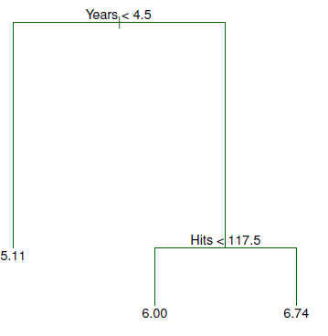
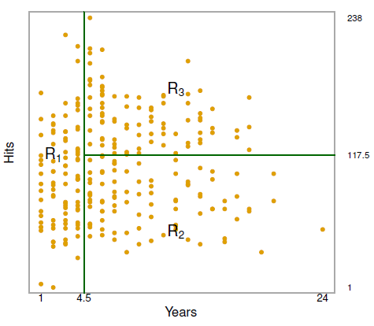
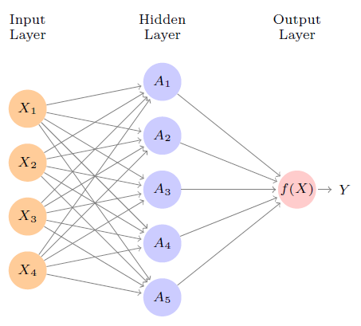

### **1. Introduction**

Soil moisture is a key variable constraining the fluxes between the land surface and the atmosphere boundary, and therefore it plays a key role in regulating the feedbacks between the terrestrial water, carbon and energy cycles. Current global soil moisture estimates are available at coarse spatial scales (between 9 and 40 km), which limits their suitability for applications such as evapotranspiration
modeling, particularly in regions with high atmospheric convection as well as farm management. Therefore, several approaches have been introduced to downscale soil moisture retrievals at finer resolution (~ field scale). Here we shall explore how we can use machine learning methods to downscale satellite soil moisture values to field measurements.

But before proceeding, let's load in the required libraries.

```{r}

#Load necessary libraries
library(ggplot2)
library(lubridate)
library(dplyr)
library(stringr)
library(scico)
library(caret)
library(sf)
library(terra)
library(spData)
# library(spDataLarge)

```

### **2. Extraction of Soil Moisture Time Series Data**

Our goal is to extract satellite soil moisture values for TAMU Farm (TFPR) and Danciger Forest (DAFO) locations and construct predictive models by utilizing the relationship with field observations in these Texas Water Observatory (TWO) locations. So, let's first extract values from the raster dataset which contains daily surface (top 5 cm) soil moisture data for the year 2019.

```{r}
# read in our data
sm_data <- rast("G:/Shared drives/VZRG_TAMU/Debasish/Class Materials/Hydrology Across Scales 2026/Lab/Lab 7 - Machine Learning/sm_conus_2019.nc")

print(sm_data)

#Plot one of the values
plot(sm_data[[51:54]])

```

Let's now extract soil moisture value for TAMU Farm. All TWO station's lat-long is provided in the `Site_locations_elevations.csv` file.

```{r}

# TFPr lat and long (Manual Input)
Long=-96.43; Lat=30.53 

# Extract time series for the location
sm_val=terra::extract(sm_data,
                 cbind(Long, Lat),    # lat-long as spatial locations
                 method='bilinear')  # or "simple" for nearest neighbor

# Create a dataframe using the dates (derived from raster layer names) and extracted values
sm_ts=data.frame(DOY =c(1:nlyr(sm_data)), # Sequence of retrieval time
                 SM_sat = as.numeric(sm_val[,]))     

# Plot NDVI time series extracted from raster brick/stack
plot(sm_ts, type="l", col="maroon", ylim=c(0.0,0.5))

```

Now, let's read in TFPr field site data for 2019 and append it to the above created dataframe.

```{r}

TFPr_2019<-read.csv("G:/Shared drives/VZRG_TAMU/Debasish/Class Materials/Hydrology Across Scales 2026/Lab/Lab 7 - Machine Learning/TFPR_ET_Node_2019_Level2_Daily.csv")

#Print first six rows
head(TFPr_2019)

#Add the field/ground soil moisture to existing dataframe
sm_ts$SM_gr <- TFPr_2019$theta_mean/100


# Create a ggplot object
ggplot(sm_ts, aes(x = DOY, group = 1)) +  # 'group = 1' ensures both lines are plotted on the same graph

  # Add a layer for time series 1
  geom_line(aes(y = SM_sat), color = "blue") +
  
  # Add a layer for time series 2
  geom_line(aes(y = SM_gr), color = "red") +
  
  # Add labels, titles, and other customization as needed
  labs(title = "Time Series Comparison",
       x = "DOY",
       y = "Soil Moisture (m3/m3)") +
  
  # Add a legend (optional)
  scale_color_manual(name = "Time Series", 
                     values = c("blue", "red"), 
                     labels = c("SM_sat", "SM_gr"))+
  theme_classic()


```
### **3. Machine Learning**

Machine learning refers to a set of tools for making sense of complex datasets. In recent years, we have seen a staggering increase in the scale and scope of data collection across virtually all areas of science and industry. As a result, machine learning has become a critical toolkit for anyone who wishes to understand data — and as more and more of today’s jobs involve data, this means that machine learning is fast becoming a critical toolkit for everyone.

ML tools can be classified as *supervised* or *unsupervised*. Broadly speaking, supervised learning involves building a machine learning model for predicting, or estimating, an output based on one or more inputs. With unsupervised learning, there are inputs but no supervising output; nevertheless we can learn relationships and structure from such data.

The `caret` package (short for Classification And REgression Training) in R is a set of functions that attempt to streamline the process for creating predictive models. The package contains tools for:

1.    data splitting
2.    pre-processing
3.    feature selection
4.    model tuning using resampling
5.    variable importance estimation
as well as other functionality.

Here, we will explore how to use `caret` package to build `Random Forest` and `Neural Network` models.

#### **3.1 Random Forest Model**

Random Forest is one of the `tree-based` methods for regression and classification which involves stratifying or segmenting the predictor space into a number of simple regions. In order to make a prediction for a given observation, we typically use the mean or the mode response value for the training observations in the region to which it belongs.

Let's take the example of Hitters data set for predicting a baseball player’s `Salary` based on `Years` (the number of years that he has played in the major leagues) and `Hits` (the number of hits that he made in the previous year). Figure 1 shows a regression tree fit to this data. It consists of a series of splitting rules, starting at the top of the tree. The top split assigns observations having $Years<4.5$ to the left branch. The predicted salary
for these players is given by the **mean response value** for the players in the data set with $Years<4.5$. Players with $Years>=4.5$ are assigned to the right branch, and then that group is further subdivided by $Hits$. Overall, the tree stratifies or segments the players into three regions of predictor space: players who have played for four or fewer years, players who have played for five or more years and who made fewer than 118 hits last year, and players who have played for five or more years and who made at least 118 hits last year.

These three regions can be written as $R1 ={X | Years<4.5}$, $R2 ={X |Years>=4.5,Hits<117.5}$, and $R3 ={X | Years>=4.5, Hits>=117.5}$. In keeping with the tree analogy, the regions R1, R2, and R3 are known as `terminal nodes` or `leaves` of the tree. **Note that decision trees are typically drawn upside down, in the sense that the leaves are at the bottom of the tree.** The points along the tree where the predictor space is split are referred to as `internal nodes`. We refer to the segments of the trees that connect the nodes as `branches`.





Thus, Random Forest performs *Prediction via Stratification of the Feature Space*. Roughly speaking, there are two steps:


1.    We divide the predictor space — that is, the set of possible values for $X_1,X_2, . . . ,X_p$ — into J distinct and non-overlapping regions, $R_1,R_2, . . . ,R_J$.

2.    For every observation that falls into the region $R_j$, we make the same prediction, which is simply the *mean* of the response values for the training observations in $R_j$.


The goal is to find boxes $R_1,R_2, . . . ,R_J$ that minimize the Residual Sum of Squares (RSS), given by

$$
\sum_{j = 1}^{J} \sum_{i \in R_{j}} (y_{i} - \hat{y}_{R_{j}})^{2}
$$

where $\hat{y}_{R_{j}}$ is the mean response for the training observations within the $jth$ box.

```{r}
#Let's remove NA rows
sm_ts<-na.omit(sm_ts)

# Split the data into training and testing sets
set.seed(123)  # Set seed for reproducibility
train_index <- createDataPartition(sm_ts$SM_gr, p = 0.8, list = FALSE)
train_data <- sm_ts[train_index, ]
test_data <- sm_ts[-train_index, ]

# Define the resampling method and other settings
control <- trainControl(method = "repeatedcv",  # Cross-validation method
                        number = 5,            # Number of folds
                        repeats = 1,           # Number of repeats
                        verboseIter = FALSE)   # Suppress output during training

# Train the neural network model
model <- train(SM_gr ~ SM_sat,  # Formula specifying the model
               data = train_data,         # Training data
               method = "rf",      # Random forest method
               trControl = control)       # Training control settings

# Print the trained model
print(model)

# Make predictions on the test data
predictions <- predict(model, newdata = test_data)

# Evaluate model performance
Performance_Metric <- postResample(pred = predictions, 
                                   obs = test_data$SM_gr)
print(Performance_Metric)

#Plot
model_df<-data.frame(pred = predictions, obs = test_data$SM_gr)

ggplot(model_df, aes(x = obs, y = pred)) +
  geom_point() +  # Add points for each observation-prediction pair
  labs(title = "Predictions vs Observations",  # Add title
       x = "Observations",                      # Add x-axis label
       y = "Predictions") +                   # Add y-axis label
  geom_abline(intercept = 0, slope = 1, linetype = "dashed", color = "indianred")+  
  theme_classic()


```


#### **3.2 Neural Network Model**

Neural networks rose to fame in the late 1980s. Then along came SVMs, boosting, and random forests, and neural networks fell somewhat from favor. Part of the reason was that neural networks required a lot of tinkering, while the new methods were more automatic. Also, on many problems the new methods outperformed
poorly-trained neural networks. Neural networks resurfaced after 2010 with the new name `deep learning`, with new architectures, additional bells and whistles, and a string of success stories on some niche problems such as image and video classification, speech and text modeling.

A neural network takes an input vector of $p$ variables $X = (X_1,X_2, . . . ,X_p)$ and builds a nonlinear function $f(X)$ to predict the response $Y$. Figure 3 shows a simple `feed-forward neural network` for modeling a quantitative response using $p = 4$ predictors. In the terminology of neural networks, the four features
$X_1, . . . ,X_4$ make up the units in the `input layer`. The arrows indicate that each of the inputs from the input layer feeds into each of the $K$ `hidden units` (we get to pick $K$; here we chose 5). The neural network model has the form:

$$
f(X) = \beta_{0} + \sum_{k = 1}^{K} \beta_{k} A_{k}
$$

where activations $A_{k}$ is computed by:

$$
A_{k} = g(w_{k0} + \sum_{j = 1}^{p} w_{kj} X_{j})
$$

where $g(z)$ is a nonlinear activation function that is specified in advance such as `sigmoid` function or `ReLU` function.

 


Fitting a neural network requires estimating the unknown parameters in above two equations. For a quantitative response, typically `squared-error` loss is used, so that the parameters are chosen to minimize:

$$
\sum_{i = 1}^{n} (y_{i} - f(X_{i}))^{2}
$$


```{r}

#Let's remove NA rows
sm_ts<-na.omit(sm_ts)

# Split the data into training and testing sets
set.seed(123)  # Set seed for reproducibility
train_index <- createDataPartition(sm_ts$SM_gr, p = 0.8, list = FALSE)
train_data <- sm_ts[train_index, ]
test_data <- sm_ts[-train_index, ]

# Define the resampling method and other settings
control <- trainControl(method = "repeatedcv",  # Cross-validation method
                        number = 5,            # Number of folds
                        repeats = 1,           # Number of repeats
                        verboseIter = FALSE)   # Suppress output during training

# Train the neural network model
model <- train(SM_gr ~ SM_sat,  # Formula specifying the model
               data = train_data,         # Training data
               method = "neuralnet",      # Neural network method
               trControl = control)       # Training control settings

# Print the trained model
print(model)

# Make predictions on the test data
predictions <- predict(model, newdata = test_data)

# Evaluate model performance
Performance_Metric <- postResample(pred = predictions, 
                                   obs = test_data$SM_gr)
print(Performance_Metric)

#Plot
model_df<-data.frame(pred = predictions, obs = test_data$SM_gr)

ggplot(model_df, aes(x = obs, y = pred)) +
  geom_point() +  # Add points for each observation-prediction pair
  labs(title = "Predictions vs Observations",  # Add title
       x = "Observations",                      # Add x-axis label
       y = "Predictions") +                   # Add y-axis label
  geom_abline(intercept = 0, slope = 1, linetype = "dashed", color = "indianred")+  
  theme_classic()

```

###  **4. Assignment**

1.    Extract satellite soil moisture (theta_mean) values for Danciger forest (DAFO) site for the year 2019. Use the lat-long values provided in `Site_locations_elevations.csv` file. Append it with ground dataset of soil moisture and plot time series of both in the same graph. (20 points) 

2.    Construct RF and NN models with 70:30 train-test split, and report their performance metrics as well as observation versus predictions plots. (20 points) 

3.    Build the same models but this time regress field soil moisture with both satellite soil moisture and soil temperature data (`Tsoil`) from DAFO csv file. What changes do you see in both model's performance? (20 points) 

4.    Use Support Vector Machine (SVM) model and validate its performance in downscaling soil moisture values with respect to RF and NN models. Explain your results based on theory behind SVM (watch: https://youtu.be/_PwhiWxHK8o?si=43oOp0UXSzcMXfTP). (40 points) 


### **5. Submission Guidelines**

1.    All submissions are due in 1 week from the date of assignment, prior to the lab session/class. 

2.    Please be to-the-point in your answers and follow the principles of scientific reporting (formal, complete and meaningful sentences supplemented with numbers and reasoning wherever applicable.

3.    Email your solutions to `debmishra@tamu.edu` as a single PDF file. Please fashion the subject of the email and the name of the submitted document name as: BAEN675_Assignment#[number]_[Last name].

### **6. References**

1.    https://topepo.github.io/caret/available-models.html
2.    https://rpubs.com/Vinit_Sehgal/lgar23 
3.    https://youtu.be/_PwhiWxHK8o?si=43oOp0UXSzcMXfTP 
